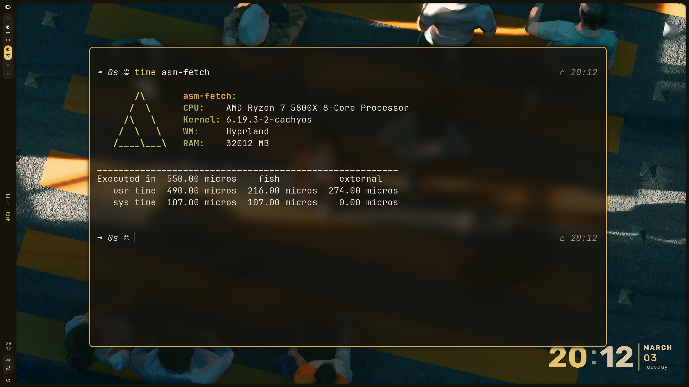

<div align="center">
  
  
  <h1>asm-fetch</h1>
  <p><b>A fetch tool written in x86 assembly :/</b></p>

<br>

<p align="center">
   
</p>

```ansi
       /\       asm-fetch:
      /  \      Host:    archy
     /\   \     Distro:  CachyOS
    /  \   \    CPU:     AMD Ryzen 7 5800X 8-Core Processor
   /____\___\   Kernel:  6.19.3-2-cachyos
                WM:      Hyprland
                Shell:   /bin/fish
                Uptime:  3h 11m
                RAM:     32012 MB
```

> [!NOTE]
> This is a learning project for me, I have made use of llms in here. If you don't like that, good - don't use it.


## 🚀 Quick Start

### Build Instructions

You'll need **NASM** and **ld** (via `binutils`).

```bash

# After installing dependencies, clone the repo
git clone https://github.com/blumenwagen/asm-fetch.git
cd asm-fetch

# Build (assemble + link + strip)
make

# Clean build artifacts
make clean

# Install to ~/.local/bin/
make install
```

Or manually:

```bash
nasm -f elf64 asm-fetch.asm -o asm-fetch.o
ld -s asm-fetch.o -o asm-fetch
```

### Running

```bash
./asm-fetch
```

> [!NOTE]
> You can also run `make install` to copy it to `~/.local/bin/`, or manually add it to your PATH.
